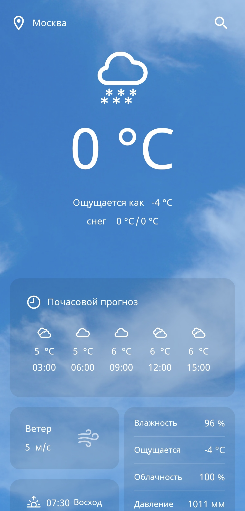
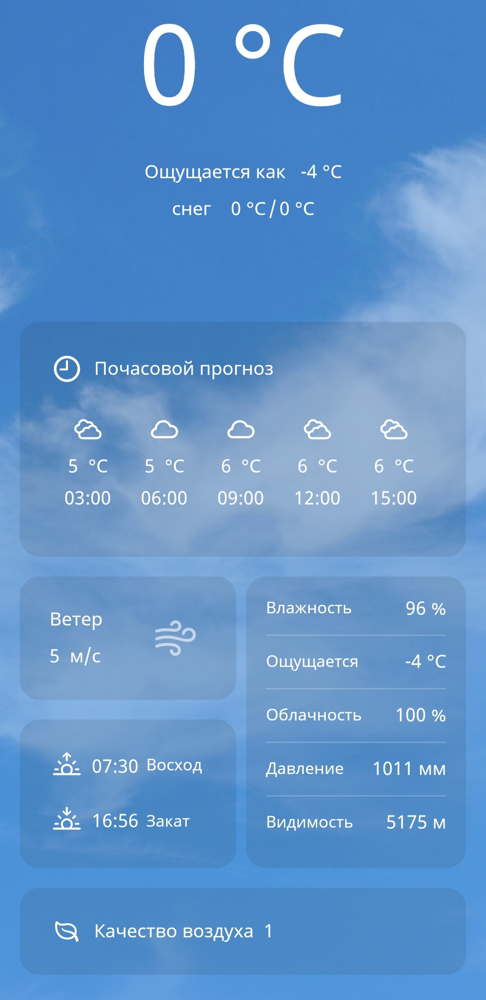

Weather App
===================

Приложения для отображения погоды в разных городах России

Используется [API] http://api.openweathermap.org

### Архитектура

* [MVVM](https://developer.android.com/jetpack/guide)
* [Kotlin 100%](https://kotlinlang.org/)
* [Coroutines](https://github.com/Kotlin/kotlinx.coroutines)
* [Flow](https://kotlinlang.org/docs/flow.html)

### Preview

### Библиотеки

* Di
    * [Dagger 2](https://github.com/google/dagger)
* Retrofit2 & OkHttp3
    * [Converter: Gson](https://mvnrepository.com/artifact/com.squareup.retrofit2/converter-gson)
    * [Retrofit](https://mvnrepository.com/artifact/com.squareup.retrofit2/retrofit)
    * [OkHttp Logging Interceptor](https://mvnrepository.com/artifact/com.squareup.okhttp3/logging-interceptor)
* Navigation
    * Single Activity
    * [Navigation component](https://developer.android.google.cn/guide/navigation/navigation-getting-started?hl=en)
* Other
    * [Glide](https://github.com/bumptech/glide)
    * [Core Kotlin Extensions](https://developer.android.com/kotlin/ktx#core)
